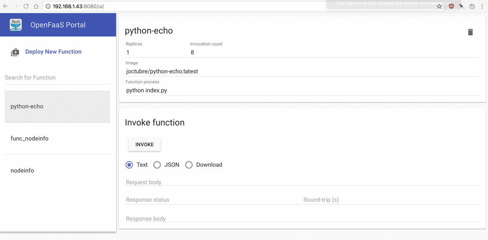

# open-faas-func-lib

The purpose of this project is to keep a collection of functions that can be ran on my Raspberry Pi Cluster.

## Remote Raspberry Pi Cluster with OpenFaaS

### Hardware:
* [Raspberry Pi](https://www.raspberrypi.org/) - Small affordable computer for learning

```
x1 Raspberry Pi 3       
x1 Raspberry Pi 2 B
x1 Raspberry Pi 1 B+
```

Each of the nodes is using a 16GB SD Card, powered through a usb power bank, and is connected directly to a router.


### Software:

Each of the nodes is installed with:
* [Raspian Stretch](https://www.raspberrypi.org/downloads/raspbian/) - Raspberry Pi Officially Supported Operating System
* [Docker](https://www.docker.com/) - Containerization 
* [Docker Swarm](https://docs.docker.com/engine/swarm/) - Cluster Management of Docker Engines
* [OpenFaas](https://github.com/openfaas/faas) - Serverless Functions Made Simple for Docker & Kubernetes

## Getting Started 

OpenFaaS has a convienient CLI you can use to get started.

For Linux:
```
$ curl -sSL https://cli.openfaas.com | sudo sh
```
For macOS:
```
$ brew install faas-cli
```

### Creating functions

Navigate to the function library:
```
$ cd function_lib
```

Scaffold a new function with the CLI:
```
$ faas-cli new --lang python-armhf python-echo
```
*Note python-armhf because this will be deployed on the Raspberry Pi Cluster

The following files will be generated:
```
python-echo/handler.py
python-echo/requirements.txt
python-echo.yml
```

Modify the python-echo.yml with the faas cluster gateway IP address:
```
provider:
  name: faas
  gateway: http://192.168.1.43:8080

functions:
  python-echo:
    lang: python-armhf
    handler: ./python-echo
    image: python-echo
```
### Building the function

Execute the build:
```
$ faas-cli build -f ./python-echo.yml
```

Verify the docker image:
```
$ docker images | grep python-echo
python-echo  latest  348eb84335ba  22 seconds ago  68.6MB
```

### Deploying the function on the remote Raspberry Pi cluster

In order for the docker images to be pulled by the remote cluster, the docker images need to be saved in a docker repository. I went with [Docker Hub](https://hub.docker.com/)
 for this example.

Login to DockerHub:
```
$ docker login
```
Tag the function image with your docker login username
```
$ docker tag python-echo yourusername/python-echo
```

Push the container:
```
$ faas-cli push -f ./python-echo.yml
```

Deploy the container on to the RPi Cluster:
```
$ faas-cli deploy -f ./python-echo.yml
Deploying: python-echo.

Deployed. 200 OK.
URL: http://192.168.1.43:8080/function/python-echo
```

Profit:


## Authors

* **John Octubre** - [johnoct](https://github.com/johnoct)

## License

This project is licensed under the MIT License - see the [LICENSE.md](LICENSE.md) file for details

## Acknowledgments

* Inspiration - [Alex Ellis](https://blog.alexellis.io/your-serverless-raspberry-pi-cluster/)
